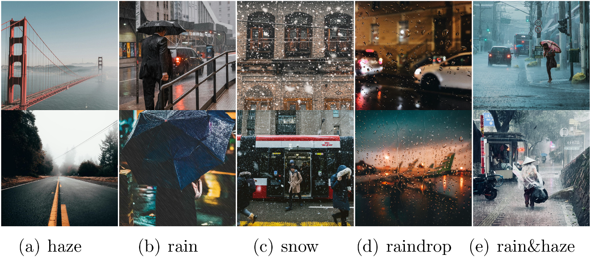
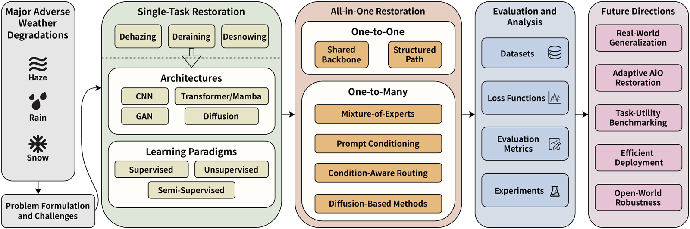

<div align="center">

# Awesome Adverse Weather Image Restoration

### Official companion repository of *Deep Image Restoration in Adverse Weather: A Survey*

Zhenbo Song, Ruixin Li, Zhenyuan Zhang, Tao Wang, Jianfeng Lu, Xin Yu, Kaihao Zhang

[](https://doi.org/10.1016/j.neunet.2026.109472)
[](https://doi.org/10.1016/j.neunet.2026.109472)
[](https://creativecommons.org/licenses/by/4.0/)
[](https://awesome.re)

[English](README.md) | [简体中文](README_ZH.md)

</div>

<p align="center">
  
</p>

## 🔥 News

- **2026.09** — We release this repository to accompany our survey and begin cataloging methods, datasets, loss functions, metrics, and benchmark results for adverse-weather image restoration.
- **2026.08** — The survey was accepted by *Neural Networks* and published online (available online 7 August 2026).

## 🌟 Introduction

Adverse-weather image restoration aims to recover clean background scenes from images degraded by various weather conditions, such as haze, rain, and snow. With the rapid development of deep learning, single-task restoration methods have achieved remarkable progress, while **All-in-One (AiO)** methods have more recently emerged to handle multiple degradations within a unified framework.

The survey jointly organizes single-task and AiO restoration models **from the perspectives of network architectures and learning paradigms**, and further reviews datasets, loss functions, evaluation metrics, and representative benchmark results, followed by key challenges and future directions.

This repository is a continuously maintained companion resource that mirrors the survey's organization, and is inspired by the presentation style of [Awesome-Image-Restoration](https://github.com/TaoWangzj/Awesome-Image-Restoration).

### Main scope

1. **Degradation-specific (single-task) restoration** — dehazing, deraining, desnowing, other weather-induced degradations, and video restoration.
2. **Network architecture evolution** — CNN, GAN, Transformer/Mamba, and diffusion models.
3. **Learning paradigms** — supervised (SL), unsupervised (UL), semi-supervised (SSL), and weakly-supervised (WSL) learning.
4. **All-in-One restoration** — One-to-One vs. One-to-Many modeling (MoE, prompts, condition-aware routing, diffusion), and general-purpose AiO models.
5. **Evaluation** — datasets, loss functions, full-reference / no-reference metrics, and benchmark results across tasks.

> **Source policy.** Every entry in this repository is traceable to the survey paper. Method and dataset tables are reproduced from the survey's own overview tables (Tables 2–7), benchmark numbers from its benchmark tables (Tables 8–13), and subgroup organization follows the corresponding survey sections. Entries are quoted exactly as printed in the survey (including abbreviated venue strings such as "ACMMM 2024" and entries whose method name the survey prints as an author-year citation only).

<p align="center">
  
</p>

> **Links.** `Paper` opens arXiv where verified, otherwise an official proceedings/publisher or author-hosted paper. `Code` points to an author-provided implementation; `Project` denotes an announced release without implementation. `Dataset` opens the official resource/download instructions. `—` means no verified link has been added, not that none exists. See the [link audit and coverage](docs/LINK_AUDIT.md).

## 🔮 Contents

- [1. Degradation-Specific Image Restoration](#1-degradation-specific-image-restoration)
  - [1.1 Image Dehazing](#11-image-dehazing)
  - [1.2 Image Deraining](#12-image-deraining)
  - [1.3 Image Desnowing](#13-image-desnowing)
  - [1.4 Other Adverse-Weather Restoration Tasks](#14-other-adverse-weather-restoration-tasks)
  - [1.5 Video-Based Adverse-Weather Restoration](#15-video-based-adverse-weather-restoration)
- [2. All-in-One Image Restoration](#2-all-in-one-image-restoration)
  - [2.1 One-to-One Modeling](#21-one-to-one-modeling)
  - [2.2 One-to-Many Modeling](#22-one-to-many-modeling)
  - [2.3 General-Purpose AiO Models](#23-general-purpose-aio-models)
- [3. Datasets](#3-datasets)
- [4. Loss Functions & Evaluation Metrics](#4-loss-functions--evaluation-metrics)
- [5. Benchmark Snapshot](#5-benchmark-snapshot)
- [6. Future Directions](#6-future-directions)
- [7. Contributing](#7-contributing)
- [8. Citation](#8-citation)

---

# 1. Degradation-Specific Image Restoration

The following tables list the deep-learning methods surveyed for each weather-degradation task. Each task table is split by the architecture category column of the survey's overview table, and the **Learning** column follows the survey: SL (Supervised Learning), UL (Unsupervised Learning), SSL (Semi-Supervised Learning), WSL (Weakly-Supervised Learning).

## 1.1 Image Dehazing

*Survey §3.1, Table 2. Image dehazing aims to restore clear scenes from haze-degraded images. Traditional (pre-deep) model-based methods relied on the atmospheric scattering model with handcrafted priors (e.g., the Dark Channel Prior, DCP); the survey's overview table covers deep learning-based methods.*

### CNN-based

| Method | Venue | Learning | Network structure | Paper | Code |
| --- | --- | --- | --- | --- | --- |
| DehazeNet (Cai et al., 2016) | TIP 2016 | SL | 4-Stage CNN with Maxout + BReLU | [Paper](https://arxiv.org/abs/1601.07661) | [Code](https://github.com/caibolun/DehazeNet) |
| MSCNN (Ren et al., 2016) | ECCV 2016 | SL | Multi-scale Residual CNN | [Paper](https://doi.org/10.1007/978-3-319-46475-6_10) | [Code](https://github.com/rwenqi/Multi-scale-CNN-Dehazing) |
| AOD-Net (Li et al., 2017) | ICCV 2017 | SL | Residual CNN + Multi-Scale | [Paper](https://openaccess.thecvf.com/content_ICCV_2017/papers/Li_AOD-Net_All-In-One_Dehazing_ICCV_2017_paper.pdf) | [Code](https://github.com/Boyiliee/AOD-Net) |
| DCPDN (Zhang & Patel, 2018a) | CVPR 2018 | SL | Densely Connected Encoder-Decoder + U-Net + Pyramid Pooling | [Paper](https://arxiv.org/abs/1803.08396) | [Code](https://github.com/hezhangsprinter/DCPDN) |
| GFN (Ren et al., 2018) | CVPR 2018 | SL | Multi-Scale Residual Encoder-Decoder + Gated Fusion | [Paper](https://arxiv.org/abs/1804.00213) | [Code](https://github.com/rwenqi/GFN-dehazing) |
| GridDehazeNet (Liu et al., 2019) | ICCV 2019 | SL | Attention + Multi-scale CNN | [Paper](https://arxiv.org/abs/1908.03245) | [Code](https://github.com/proteus1991/GridDehazeNet) |
| FAMED-Net (Zhang & Tao, 2019) | TIP 2019 | SL | Multi-Scale CNN + Dense Connection | [Paper](https://arxiv.org/abs/1906.04334) | [Code](https://github.com/chaimi2013/FAMED-Net) |
| Deep DCP (Golts et al., 2019) | TIP 2019 | UL | Dilated Residual CNN | [Paper](https://arxiv.org/abs/1812.07051) | — |
| SSID (Li et al., 2019a) | TIP 2019 | SSL | Encoder-Decoder Architecture with Attention Mechanism | [Paper](https://doi.org/10.1109/TIP.2019.2952690) | — |
| FFA-Net (Qin et al., 2020) | AAAI 2020 | SL | Residual + Attention CNN | [Paper](https://arxiv.org/abs/1911.07559) | [Code](https://github.com/zhilin007/FFA-Net) |
| MSCNN-HE (Ren et al., 2020) | IJCV 2020 | SL | Multi-scale + Coarse-scale + Fine-scale + Edge Guided | [Paper](https://doi.org/10.1007/s11263-019-01235-8) | — |
| MSBDN (Dong et al., 2020a) | CVPR 2020 | SL | Multi-scale Residual U-Net + Boosted Decoder + DFF | [Paper](https://arxiv.org/abs/2004.13388) | [Code](https://github.com/BookerDeWitt/MSBDN-DFF) |
| CCDM (Zhang et al., 2020b) | CVPR 2020 | SSL | Cycle Reconstruction + Consistency Modules | [Paper](https://openaccess.thecvf.com/content_CVPRW_2020/papers/w51/Zhang_Color-Constrained_Dehazing_Model_CVPRW_2020_paper.pdf) | — |
| PGC (Zhao et al., 2020) | TCSVT 2020 | SL | PGC-UNet | [Paper](https://doi.org/10.1109/TCSVT.2020.3036992) | [Code](https://github.com/phoenixtreesky7/PGC-DN) |
| Light-DehazeNet (Ullah et al., 2021) | TIP 2021 | SL | Lightweight CNN + CVR Module | [Paper](https://doi.org/10.1109/TIP.2021.3116790) | — |
| AECR-Net (Wu et al., 2021) | CVPR 2021 | SL | Autoencoder-style Residual CNN | [Paper](https://arxiv.org/abs/2104.09367) | [Code](https://github.com/GlassyWu/AECR-Net) |
| Jo et al. (Jo & Sim, 2021) | CVPR 2021 | SL | Multi-Scale Residual CNN | [Paper](https://openaccess.thecvf.com/content/CVPR2021W/NTIRE/papers/Jo_Multi-Scale_Selective_Residual_Learning_for_Non-Homogeneous_Dehazing_CVPRW_2021_paper.pdf) | — |
| PSD (Chen et al., 2021c) | CVPR 2021 | SSL | Backbone CNN + Physics-compatible Head + A-Net | [Paper](https://openaccess.thecvf.com/content/CVPR2021/papers/Chen_PSD_Principled_Synthetic-to-Real_Dehazing_Guided_by_Physical_Priors_CVPR_2021_paper.pdf) | [Code](https://github.com/zychen-ustc/PSD-Principled-Synthetic-to-Real-Dehazing-Guided-by-Physical-Priors) |
| Yu et al. (Yu et al., 2021b) | CVPR 2021 | SL | Two-Branch CNN + Attention + Ensemble Fusion | [Paper](https://arxiv.org/abs/2104.08902) | [Code](https://github.com/liuh127/NTIRE-2021-Dehazing-Two-branch) |
| YOLY (Li et al., 2021) | IJCV 2021 | UL | Layer Disentanglement with J-Net, T-Net, A-Net | [Paper](https://arxiv.org/abs/2006.16829) | [Code](https://github.com/XLearning-SCU/2021-IJCV-YOLY) |
| DCNet (Chen et al., 2021d) | ICME 2021 | SSL | Encoder-decoder + Depth/Transmission dual estimation | [Paper](https://doi.org/10.1109/ICME51207.2021.9428282) | — |
| FSR (Liu et al., 2021c) | ACMMM 2021 | SSL | Hierarchical Encoder + Multi-scale Supervision | [Paper](https://arxiv.org/abs/2108.02934) | [Code](https://github.com/liuye123321/DMT-Net) |
| PTTD (Chen et al., 2024c) | ECCV 2024 | SL | Prompt Generation + Feature Adaptation + AECRNet | [Paper](https://arxiv.org/abs/2309.17389) | [Code](https://github.com/cecret3350/PTTD-Dehazing) |
| DCMPNet (Zhang et al., 2024c) | CVPR 2024 | SL | Dehazing branch + Depth estimation branch | [Paper](https://arxiv.org/abs/2403.01105) | [Code](https://github.com/zhoushen1/DCMPNet) |
| Yin et al. (Yin & Liu, 2025) | Neural Netw. 2025 | UL | Multi-Branch + Multi-Scale Fusion | [Paper](https://www.sciencedirect.com/science/article/abs/pii/S0893608025003740) | — |
| CoA (Ma et al., 2025) | CVPR 2025 | UL | Compressed student + bi-level domain adaptation | [Paper](https://arxiv.org/abs/2504.05590) | [Code](https://github.com/fyxnl/COA) |

### GAN-based

| Method | Venue | Learning | Network structure | Paper | Code |
| --- | --- | --- | --- | --- | --- |
| Dehaze-cGAN (Li et al., 2018b) | CVPR 2018 | SL | Encoder–Decoder Generator + CNN Discriminator | [Paper](https://openaccess.thecvf.com/content_cvpr_2018/papers/Li_Single_Image_Dehazing_CVPR_2018_paper.pdf) | — |
| Cycle-Dehaze (Engin et al., 2018) | CVPR 2018 | UL | CycleGAN + Perceptual Encoder | [Paper](https://arxiv.org/abs/1805.05308) | [Code](https://github.com/engindeniz/Cycle-Dehaze) |
| DDN (Yang et al., 2018) | AAAI 2018 | UL | Disentangled Generator + Multi-Scale Discriminator | [Paper](https://aaai.org/papers/12317-towards-perceptual-image-dehazing-by-physics-based-disentanglement-and-adversarial-training/) | — |
| DehazeGAN (Zhu et al., 2018) | IJCAI 2018 | SL | Dense CNN Generator + PatchGAN Discriminator | [Paper](https://www.ijcai.org/proceedings/2018/172) | — |
| HRGAN (Pang et al., 2018) | TCSVT 2018 | SL | UNTA + Discriminator | [Paper](https://doi.org/10.1109/TCSVT.2018.2880223) | — |
| EPDN (Qu et al., 2019) | CVPR 2019 | SL | Multi-Resolution Generator + Multi-Scale Discriminator + Enhancer | [Paper](https://openaccess.thecvf.com/content_CVPR_2019/papers/Qu_Enhanced_Pix2pix_Dehazing_Network_CVPR_2019_paper.pdf) | [Code](https://github.com/ErinChen1/EPDN) |
| CDNet (Dudhane & Murala, 2019) | WACV 2019 | UL | Encoder–Decoder Generator + CycleGAN Discriminator | [Paper](https://doi.org/10.1109/WACV.2019.00127) | — |
| Cycle-Defog2Refog (Liu et al., 2020) | TIP 2020 | UL | CycleGAN + Encoder-Decoder + Enhancer | [Paper](https://arxiv.org/abs/1902.01374) | — |
| Park et al. (Park et al., 2020) | TIP 2020 | UL + SL | CycleGAN + cGAN + Fusion CNN | [Paper](https://doi.org/10.1109/TIP.2020.2975986) | — |
| FD-GAN (Dong et al., 2020b) | AAAI 2020 | SL | Densely Connected Encoder-Decoder + Fusion Discriminator | [Paper](https://arxiv.org/abs/2001.06968) | [Code](https://github.com/WeilanAnnn/FD-GAN) |
| DW-GAN (Fu et al., 2021) | CVPR 2021 | SL | DWT Branch + Knowledge Adaptation Branch | [Paper](https://arxiv.org/abs/2104.08911) | [Code](https://github.com/liuh127/NTIRE-2021-Dehazing-DWGAN) |
| TMS-GAN (Wang et al., 2021b) | TCSVT 2021 | SL | HgGAN + HrGAN | [Paper](https://doi.org/10.1109/TCSVT.2021.3097713) | — |
| RefineDNet (Zhao et al., 2021) | TIP 2021 | WSL | RefineDNet | [Paper](https://doi.org/10.1109/TIP.2021.3060873) | [Code](https://github.com/xiaofeng94/RefineDNet-for-dehazing) |
| ODCR (Wang et al., 2024b) | CVPR 2024 | UL | Orthogonal MLPs + DWFC + PatchNCE | [Paper](https://arxiv.org/abs/2404.17825) | — |
| UBRFC-Net (Sun et al., 2024a) | Neural Netw. 2024 | UL | BCRF + Adaptive FCA | [Paper](https://www.sciencedirect.com/science/article/pii/S0893608024002387) | — |
| IPC-Dehaze (Fu et al., 2025) | CVPR 2025 | SL | Code-Predictor + Code-Critic + VQGAN | [Paper](https://arxiv.org/abs/2503.13147) | [Code](https://github.com/Jiayi-Fu/IPC-Dehaze) |

### Transformer / Mamba-based

| Method | Venue | Learning | Network structure | Paper | Code |
| --- | --- | --- | --- | --- | --- |
| DeHamer (Guo et al., 2022) | CVPR 2022 | SL | Two-branch Transformer + Physical Prior Embedding | [Paper](https://openaccess.thecvf.com/content/CVPR2022/papers/Guo_Image_Dehazing_Transformer_With_Transmission-Aware_3D_Position_Embedding_CVPR_2022_paper.pdf) | [Code](https://github.com/Li-Chongyi/Dehamer) |
| DehazeFormer (Song et al., 2023) | TIP 2023 | SL | Hierarchical Transformer + Local-Enhancement Modules | [Paper](https://arxiv.org/abs/2204.03883) | [Code](https://github.com/IDKiro/DehazeFormer) |
| MB-TaylorFormer (Qiu et al., 2023) | ICCV 2023 | SL | Multi-Branch Taylor-Series Transformer | [Paper](https://arxiv.org/abs/2308.14036) | [Code](https://github.com/FVL2020/ICCV-2023-MB-TaylorFormer) |
| MoE-Mamba (Zhang et al., 2024a) | ACMMM 2024 | SL | Mamba Backbone + MoE Block + LMM-based Intensity-aware Block | [Paper](https://arxiv.org/abs/2410.16095) | [Code](https://github.com/wangzrk/LMHaze) |
| DehazeXL (Chen et al., 2025a) | CVPR 2025 | SL | Patch encoder + global attention + decoder | [Paper](https://arxiv.org/abs/2504.09621) | [Code](https://github.com/CastleChen339/DehazeXL) |

### Diffusion-based

| Method | Venue | Learning | Network structure | Paper | Code |
| --- | --- | --- | --- | --- | --- |
| DiffLI2D (Yang et al., 2024b) | ECCV 2024 | SL | Pretrained Diffusion Backbone + U-Net + H-space Decoder | [Paper](https://arxiv.org/abs/2509.20091) | — |
| Diff-Dehazer (Lan et al., 2025) | AAAI 2025 | UL | Stable Diffusion + CycleGAN + PAG + TAG | [Paper](https://arxiv.org/abs/2503.15017) | [Code](https://github.com/ywxjm/Diff-Dehazer) |
| DiffDehaze (Wang et al., 2025b) | CVPR 2025 | SL | HazeGen + DiffDehaze + AccSamp | [Paper](https://arxiv.org/abs/2503.19262) | [Code](https://github.com/ruiyi-w/Learning-Hazing-to-Dehazing) |

## 1.2 Image Deraining

*Survey §3.2, Table 3. Image deraining aims to remove rain streaks and rain-induced veiling effects. Raindrop removal is also treated within this task family by the survey (see the RaindropAttention entry below and the RainDrop benchmark in Section 5).*

### CNN-based

| Method | Venue | Learning | Network structure | Paper | Code |
| --- | --- | --- | --- | --- | --- |
| DerainNet (Fu et al., 2017a) | TIP 2017 | SL | Three Layers | [Paper](https://arxiv.org/abs/1609.02087) | — |
| DDN (Fu et al., 2017b) | CVPR 2017 | SL | Residual Network | [Paper](https://openaccess.thecvf.com/content_cvpr_2017/papers/Fu_Removing_Rain_From_CVPR_2017_paper.pdf) | [Code](https://github.com/XMU-smartdsp/Removing_Rain) |
| JORDER (Yang et al., 2017) | CVPR 2017 | SL | Multi-Task Network | [Paper](https://arxiv.org/abs/1609.07769) | [Code](https://github.com/ZhangXinNan/RainDetectionAndRemoval) |
| RESCAN (Li et al., 2018c) | ECCV 2018 | SL | Recurrent Network | [Paper](https://arxiv.org/abs/1807.05698) | [Code](https://github.com/XiaLiPKU/RESCAN) |
| PReNet (Ren et al., 2019) | CVPR 2019 | SL | Recursive Network | [Paper](https://arxiv.org/abs/1901.09221) | [Code](https://github.com/csdwren/PReNet) |
| DAF-Net (Hu et al., 2019) | CVPR 2019 | SL | Residual Network | [Paper](https://openaccess.thecvf.com/content_CVPR_2019/papers/Hu_Depth-Attentional_Features_for_Single-Image_Rain_Removal_CVPR_2019_paper.pdf) | — |
| SPANet (Wang et al., 2019) | CVPR 2019 | SL | Multi-Stage Network | [Paper](https://arxiv.org/abs/1904.01538) | [Code](https://github.com/stevewongv/SPANet) |
| UMRL (Yasarla & Patel, 2019) | CVPR 2019 | SL | Multi-Scale Network | [Paper](https://arxiv.org/abs/1906.11129) | [Code](https://github.com/rajeevyasarla/UMRL--using-Cycle-Spinning) |
| SSIR (Wei et al., 2019) | CVPR 2019 | SSL | Two Subnetworks | [Paper](https://arxiv.org/abs/1807.11078) | [Code](https://github.com/wwzjer/Semi-supervised-IRR) |
| RaindropAttention (Quan et al., 2019) | ICCV 2019 | SL | U-Net Like Network | [Paper](https://openaccess.thecvf.com/content_ICCV_2019/papers/Quan_Deep_Learning_for_Seeing_Through_Window_With_Raindrops_ICCV_2019_paper.pdf) | — |
| LPNet (Fu et al., 2019) | TNNLS 2019 | SL | Pyramid Network | [Paper](https://arxiv.org/abs/1805.06173) | — |
| JORDER-E (Yang et al., 2019) | TPAMI 2019 | SL | Multi-Task Network | [Paper](https://doi.org/10.1109/TPAMI.2019.2895793) | [Code](https://github.com/flyywh/JORDER-E-Deep-Image-deraining-TPAMI-2019-Journal) |
| MSPFN (Jiang et al., 2020) | CVPR 2020 | SL | Multi-Scale Network | [Paper](https://arxiv.org/abs/2003.10985) | [Code](https://github.com/kuijiang94/MSPFN) |
| DRD-Net (Deng et al., 2020) | CVPR 2020 | SL | Two Subnetworks | [Paper](https://openaccess.thecvf.com/content_CVPR_2020/papers/Deng_Detail-recovery_Image_Deraining_via_Context_Aggregation_Networks_CVPR_2020_paper.pdf) | [Code](https://github.com/Dengsgithub/DRD-Net) |
| RCDNet (Wang et al., 2020) | CVPR 2020 | SL | Multi-Stage Network | [Paper](https://arxiv.org/abs/2005.01333) | [Code](https://github.com/hongwang01/RCDNet) |
| Syn2Real (Yasarla et al., 2020) | CVPR 2020 | SSL | U-Net Like Network | [Paper](https://arxiv.org/abs/2006.05580) | [Code](https://github.com/rajeevyasarla/Syn2Real) |
| MOSS (Huang et al., 2021) | CVPR 2021 | SSL | U-Net Like Network | [Paper](https://openaccess.thecvf.com/content/CVPR2021/papers/Huang_Memory_Oriented_Transfer_Learning_for_Semi-Supervised_Image_Deraining_CVPR_2021_paper.pdf) | — |
| SPDNet (Yi et al., 2021) | ICCV 2021 | SL | Recursive Network | [Paper](https://arxiv.org/abs/2108.09079) | [Code](https://github.com/Joyies/SPDNet) |
| UDRDR (Liu et al., 2021b) | ICCV 2021 | SSL | Three Subnetworks | [Paper](https://openaccess.thecvf.com/content/ICCV2021/papers/Liu_Unpaired_Learning_for_Deep_Image_Deraining_With_Rain_Direction_Regularizer_ICCV_2021_paper.pdf) | — |
| UDGNet (Yu et al., 2021a) | ACMMM 2021 | UL | Multi-Task Network | [Paper](https://arxiv.org/abs/2203.13699) | — |
| EfficientDeRain (Guo et al., 2021) | AAAI 2021 | SL | U-Net Like Network | [Paper](https://arxiv.org/abs/2009.09238) | [Code](https://github.com/tsingqguo/efficientderain) |
| ESDNet (Song et al., 2024) | IJCAI 2024 | SL | SNN | [Paper](https://arxiv.org/abs/2405.06277) | [Code](https://github.com/MingTian99/ESDNet) |
| PADUM (Xiao & Xia, 2025) | Neural Netw. 2025 | SL | APGD + SFPM | [Paper](https://www.sciencedirect.com/science/article/abs/pii/S0893608025007257) | [Code](https://github.com/cassiopeia-yxx/PADUM) |
| DEMore-Net (Wang et al., 2025c) | Neural Netw. 2025 | SL | Depth Estimation + MOR + HNB | [Paper](https://www.sciencedirect.com/science/article/pii/S0893608025006197?dgcid=rss_sd_all) | — |
| CSUD (Dong et al., 2025) | CVPR 2025 | SL | U-shaped Dense Net + Cross-scale Spatial Feature | [Paper](https://arxiv.org/abs/2503.18703) | [Code](https://github.com/GuangluDong0728/CSUD-Unsupervised-Deraining-CVPR2025) |

### GAN-based

| Method | Venue | Learning | Network structure | Paper | Code |
| --- | --- | --- | --- | --- | --- |
| DID-MDN (Zhang & Patel, 2018b) | CVPR 2018 | SL | Multi-Stream Network | [Paper](https://arxiv.org/abs/1802.07412) | [Code](https://github.com/hezhangsprinter/DID-MDN) |
| AttentGAN (Qian et al., 2018) | CVPR 2018 | SL | Recurrent Network | [Paper](https://arxiv.org/abs/1711.10098) | [Code](https://github.com/rui1996/DeRaindrop) |
| RR-GAN (Zhu et al., 2019b) | AAAI 2019 | UL | Multi-Scale Network | [Paper](https://ojs.aaai.org/index.php/AAAI/article/view/4971) | — |
| UD-GAN (Jin et al., 2019) | ICIP 2019 | UL | Multi-Task Network | [Paper](https://arxiv.org/abs/1811.08575) | — |
| ID-CGAN (Zhang et al., 2019) | TCSVT 2019 | SL | Two Subnetworks | [Paper](https://arxiv.org/abs/1701.05957) | [Code](https://github.com/hezhangsprinter/ID-CGAN) |
| HRGAN (Li et al., 2019b) | CVPR 2019 | SL | Multi-Stage Network | [Paper](https://arxiv.org/abs/1904.05050) | [Code](https://github.com/liruoteng/HeavyRainRemoval) |
| DerainCycleGAN (Wei et al., 2021) | TIP 2021 | UL | CycleGAN | [Paper](https://arxiv.org/abs/1912.07015) | — |
| VRGNet (Wang et al., 2021a) | CVPR 2021 | SL | Four Subnetworks | [Paper](https://arxiv.org/abs/2008.03580) | [Code](https://github.com/hongwang01/VRGNet) |
| JRGR (Ye et al., 2021) | CVPR 2021 | SL | CycleGAN | [Paper](https://arxiv.org/abs/2103.13660) | — |
| DCD-GAN (Chen et al., 2022c) | CVPR 2022 | UL | CycleGAN | [Paper](https://arxiv.org/abs/2109.02973) | [Code](https://github.com/cschenxiang/DCD-GAN) |
| NLCL (Ye et al., 2022b) | CVPR 2022 | UL | Two Subnetworks | [Paper](https://arxiv.org/abs/2203.11509) | — |

### Transformer / Mamba-based

| Method | Venue | Learning | Network structure | Paper | Code |
| --- | --- | --- | --- | --- | --- |
| ELF (Jiang et al., 2022) | ACMMM 2022 | SL | Two Subnetworks | [Paper](https://arxiv.org/abs/2207.10455) | [Code](https://github.com/kuijiang94/Magic-ELF) |
| IDT (Xiao et al., 2022) | TPAMI 2022 | SL | U-Net Like Network | [Paper](https://ieeexplore.ieee.org/document/9798773) | [Code](https://github.com/jiexiaou/IDT) |
| HCT-FFN (Chen et al., 2023b) | AAAI 2023 | SL | Multi-Stage Network | [Paper](https://ojs.aaai.org/index.php/AAAI/article/view/25111) | [Code](https://github.com/cschenxiang/HCT-FFN) |
| DRSformer (Chen et al., 2023a) | CVPR 2023 | SL | U-Net Like Network | [Paper](https://arxiv.org/abs/2303.11950) | [Code](https://github.com/cschenxiang/DRSformer) |
| SmartAssign (Wang et al., 2023c) | CVPR 2023 | SL | Multi-Task Network | [Paper](https://openaccess.thecvf.com/content/CVPR2023/papers/Wang_SmartAssign_Learning_a_Smart_Knowledge_Assignment_Strategy_for_Deraining_and_CVPR_2023_paper.pdf) | — |
| SCD-Former (Guo et al., 2023) | ICCV 2023 | SL | Transformer + Cross-Layer Attention | [Paper](https://arxiv.org/abs/2308.03867) | [Code](https://github.com/yunguo224/LHP-Rain) |
| RLP (Zhang et al., 2023b) | ICCV 2023 | SL | RLP + RPIM + DM | [Paper](https://openaccess.thecvf.com/content/ICCV2023/papers/Zhang_Learning_Rain_Location_Prior_for_Nighttime_Deraining_ICCV_2023_paper.pdf) | [Code](https://github.com/zkawfanx/RLP) |
| NeRD-Rain (Chen et al., 2024b) | CVPR 2024 | SL | U-Net Like Network | [Paper](https://arxiv.org/abs/2404.01547) | [Code](https://github.com/cschenxiang/NeRD-Rain) |
| FADformer (Gao et al., 2024a) | ECCV 2024 | SL | FAD + Transformer + Cross-scale interaction | [Paper](https://www.ecva.net/papers/eccv_2024/papers_ECCV/html/5751_ECCV_2024_paper.php) | [Code](https://github.com/deng-ai-lab/FADformer) |
| FreqMamba (Zou et al., 2024) | ACMMM 2024 | SL | U-Net + Triple-branch FreqSSM Block | [Paper](https://arxiv.org/abs/2404.09476) | — |
| MS-DEMamba (Cheng et al., 2025) | ACMMM 2025 | SL | Dual-branch Mamba + Dynamic Adaptive Scanning Blocks | [Paper](https://doi.org/10.1145/3746027.3758228) | — |

## 1.3 Image Desnowing

*Survey §3.3, Table 4. Image desnowing aims to remove snowflakes and snow-induced veiling effects. Rows whose method name the survey prints only as an author-year citation are quoted below exactly as in the survey.*

### CNN-based

| Method | Venue | Learning | Network structure | Paper | Code |
| --- | --- | --- | --- | --- | --- |
| DesnowNet (Liu et al., 2018) | TIP 2018 | SL | Residual + Multi-scale | [Paper](https://arxiv.org/abs/1708.04512) | — |
| JSTASR (Chen et al., 2020) | ECCV 2020 | SL | JSTASR | [Paper](https://www.ecva.net/papers/eccv_2020/papers_ECCV/papers/123660749.pdf) | [Code](https://github.com/weitingchen83/JSTASR-DesnowNet-ECCV-2020) |
| HDCW-Net (Chen et al., 2021b) | ICCV 2021 | SL | Residual | [Paper](https://openaccess.thecvf.com/content/ICCV2021/papers/Chen_ALL_Snow_Removed_Single_Image_Desnowing_Algorithm_Using_Hierarchical_Dual-Tree_ICCV_2021_paper.pdf) | [Code](https://github.com/weitingchen83/ICCV2021-Single-Image-Desnowing-HDCWNet) |
| DDMSNet (Zhang et al., 2021) | TIP 2021 | SL | Residual + DDMSNet + Multi-scale | [Paper](https://arxiv.org/abs/2103.11298) | — |
| Ye et al. (2022a) | ACCV 2022 | SL | Asym. Encoder-Decoder + Multi-scale Pyramid | [Paper](https://arxiv.org/abs/2207.05605) | [Code](https://github.com/Owen718/Towards-Real-time-High-Definition-Image-Snow-Removal-Efficient-Pyramid-Network) |
| HCSD-Net (Zhang et al., 2023d) | ACMMM 2023 | SL | RGB Branch + Hue Branch + Multi-Scale Fusion Module | [Paper](https://doi.org/10.1145/3581783.3613789) | [Code](https://github.com/ttz-rainbow/HCSD-Net) |
| PEUNet (Guo et al., 2025) | TCSVT 2025 | SL | Prior-Enhanced Unfolding | [Paper](https://doi.org/10.1109/TCSVT.2025.3526647) | — |
| SnowMaster (Lai et al., 2025) | CVPR 2025 | SSL | CNN + MLLM eval + Mean-teacher | [Paper](https://openaccess.thecvf.com/content/CVPR2025/papers/Lai_SnowMaster_Comprehensive_Real-world_Image_Desnowing_via_MLLM_with_Multi-Model_Feedback_CVPR_2025_paper.pdf) | [Code](https://github.com/alexlai2860/SnowMaster) |

### GAN-based

| Method | Venue | Learning | Network structure | Paper | Code |
| --- | --- | --- | --- | --- | --- |
| Li et al. (2019d) | IEEE Access 2019 | SL | Snow-mask estimation + composition GAN | [Paper](https://doi.org/10.1109/ACCESS.2019.2900323) | — |
| DesnowGAN (Jaw et al., 2020) | TCSVT 2020 | SL | SR + Refinement + WGAN-GP | [Paper](https://doi.org/10.1109/TCSVT.2020.3003025) | — |

### Transformer-based

| Method | Venue | Learning | Network structure | Paper | Code |
| --- | --- | --- | --- | --- | --- |
| SmartAssign (Wang et al., 2023c) | CVPR 2023 | SL | Multi-task Network | [Paper](https://openaccess.thecvf.com/content/CVPR2023/papers/Wang_SmartAssign_Learning_a_Smart_Knowledge_Assignment_Strategy_for_Deraining_and_CVPR_2023_paper.pdf) | — |

> In addition to the deep-learning entries tabulated above, the survey text also discusses model-based desnowing (e.g., MGF, Zheng et al., 2013) and the invertible-neural-network approach InvDSNet (Quan et al., 2023), which separates snow and clean layers via a two-path architecture (Survey §3.3).

## 1.4 Other Adverse-Weather Restoration Tasks

*Survey §3.4. Beyond dehazing, deraining, and desnowing, the survey reviews other weather-induced degradations. These tasks are discussed in the text (mostly with citation clusters rather than individually named methods), and we reproduce the survey's grouping below.*

| Degradation type | Survey references | Notes (from Survey §3.4) |
|---|---|---|
| Sandstorm restoration | (Liu et al., 2022; Liu et al., 2021a; Si et al., 2023) | Mitigates the effects of airborne dust particles: low contrast, color distortion, heavy haze-like veils |
| Heavy rain | (Li et al., 2019b; Wen et al., 2024; Zhang et al., 2024b) | Mixture of streaks, accumulated water droplets, and mist — non-uniform degradation beyond standard deraining |
| Nighttime haze | (Cong et al., 2024; Jin et al., 2023; Liu et al., 2023; Yan et al., 2020; Zhang et al., 2017; Zhang et al., 2020a) | Low visibility + artificial light + sensor noise; often requires joint modeling of illumination and transmission |
| Frosted scenes | — | Opaque or semi-transparent crystalline patterns that obscure parts of the image |

The survey additionally discusses coupled degradations such as rain with low light (L2RIRNet, Lin et al., 2025a; and MS-DEMamba, Cheng et al., 2025, which is tabulated in Section 1.2) and rain&haze mixtures (Survey §3.6).

## 1.5 Video-Based Adverse-Weather Restoration

*Survey §3.5. Video restoration must recover spatial details in each frame and maintain temporal consistency across adjacent frames.*

| Method | Task | Approach (from Survey §3.5) | Paper | Code |
| --- | --- | --- | --- | --- |
| MAP-Net (Xu et al., 2023) | Video dehazing | Physical-prior modeling with multi-range temporal alignment (memory-based prior guidance + multi-range scene radiance recovery) | [Paper](https://arxiv.org/abs/2303.09757) | [Code](https://github.com/jiaqixuac/MAP-Net) |
| SemiVDN (Wu et al., 2024) | Video desnowing | Semi-supervised; distribution-driven contrastive regularization + prior-guided temporal decoupling experts; incorporates 85 real-world snowy videos | [Paper](https://arxiv.org/abs/2410.07901) | [Code](https://github.com/TonyHongtaoWu/SemiVDN) |
| Wang et al. (2023b) | Video deraining | Unsupervised, event-camera-assisted framework with asymmetric separation, cross-modal fusion, and cross-modal contrastive learning | [Paper](https://openaccess.thecvf.com/content/ICCV2023/papers/Wang_Unsupervised_Video_Deraining_with_An_Event_Camera_ICCV_2023_paper.pdf) | [Code](https://github.com/booker-max/Unsupervised-Deraining-with-Event-Camera) |

---

# 2. All-in-One Image Restoration

*Survey §4. AiO methods handle multiple weather degradations within a unified architecture. Depending on their inference behavior, the survey groups them into **One-to-One** methods (fixed inference path for all inputs) and **One-to-Many** methods (inference adapted by degradation-related cues such as prompts, classifiers, routing weights, expert selection, or other condition-aware signals). Table 5 of the survey summarizes the taxonomy; the tables below follow it.*

## 2.1 One-to-One Modeling

### Shared Backbone

| Method | Key idea | Venue | Paper | Code |
| --- | --- | ---: | --- | --- |
| TransWeather (Valanarasu et al., 2022) | Plain Transformer for joint weather restoration | CVPR 2022 | [Paper](https://arxiv.org/abs/2111.14813) | [Code](https://github.com/jeya-maria-jose/TransWeather) |
| Restormer (Zamir et al., 2022a) | Efficient Transformer with shared restoration path | CVPR 2022 | [Paper](https://arxiv.org/abs/2111.09881) | [Code](https://github.com/swz30/Restormer) |
| Uformer (Wang et al., 2022) | U-shaped Transformer with multi-scale fusion | CVPR 2022 | [Paper](https://arxiv.org/abs/2106.03106) | [Code](https://github.com/ZhendongWang6/Uformer) |
| FocalNet (Cui et al., 2023) | Focal modulation in a unified backbone | ICCV 2023 | [Paper](https://openaccess.thecvf.com/content/ICCV2023/html/Cui_Focal_Network_for_Image_Restoration_ICCV_2023_paper.html) | [Code](https://github.com/c-yn/FocalNet) |
| AIRFormer (Gao et al., 2024b) | Frequency-aware Transformer for unified restoration | TCSVT 2024 | [Paper](https://doi.org/10.1109/TCSVT.2023.3299324) | — |
| Histoformer (Sun et al., 2024b) | Histogram-guided attention in a shared graph | ECCV 2024 | [Paper](https://arxiv.org/abs/2407.10172) | [Code](https://github.com/sunshangquan/Histoformer) |
| ACL (Gu et al., 2025) | Mamba-based linear attention for unified restoration | CVPR 2025 | [Paper](https://openaccess.thecvf.com/content/CVPR2025/html/Gu_ACL_Activating_Capability_of_Linear_Attention_for_Image_Restoration_CVPR_2025_paper.html) | [Code](https://github.com/ClimBin/ACLNet) |

### Structured Path

| Method | Key idea | Venue | Paper | Code |
| --- | --- | ---: | --- | --- |
| All-in-One (Li et al., 2020) | Fixed multi-encoder architecture with NAS fusion | CVPR 2020 | [Paper](https://openaccess.thecvf.com/content_CVPR_2020/html/Li_All_in_One_Bad_Weather_Removal_Using_Architectural_Search_CVPR_2020_paper.html) | — |
| MPRNet (Zamir et al., 2021) | Progressive multi-stage restoration with fixed graph | CVPR 2021 | [Paper](https://arxiv.org/abs/2102.02808) | [Code](https://github.com/swz30/MPRNet) |

## 2.2 One-to-Many Modeling

### Mixture-of-Experts (MoE)

| Method | Key idea | Venue | Paper | Code |
| --- | --- | ---: | --- | --- |
| Chen et al. (2022b) | Expert learning with contrastive regularization | CVPR 2022 | [Paper](https://openaccess.thecvf.com/content/CVPR2022/html/Chen_Learning_Multiple_Adverse_Weather_Removal_via_Two-Stage_Knowledge_Learning_and_CVPR_2022_paper.html) | [Code](https://github.com/fingerk28/Two-stage-Knowledge-For-Multiple-Adverse-Weather-Removal) |
| AWRCP (Ye et al., 2023) | Codebook-guided weather expert fusion | ICCV 2023 | [Paper](https://openaccess.thecvf.com/content/ICCV2023/html/Ye_Adverse_Weather_Removal_with_Codebook_Priors_ICCV_2023_paper.html) | [Code](https://github.com/Owen718/AWRCP) |
| MetaWeather (Kim et al., 2024) | Meta-initialized experts for weather adaptation | ECCV 2024 | [Paper](https://arxiv.org/abs/2308.14334) | [Code](https://github.com/RangeWING/MetaWeather) |
| LDR (Yang et al., 2024a) | Language-guided expert routing | CVPR 2024 | [Paper](https://arxiv.org/abs/2312.01381) | [Code](https://github.com/noxsine/LDR) |
| SLER-IR (Peng et al., 2026) | Spherical layer-wise expert routing | arXiv 2026 | [Paper](https://arxiv.org/abs/2603.05940) | — |

### Prompt Conditioning

| Method | Key idea | Venue | Paper | Code |
| --- | --- | ---: | --- | --- |
| PromptIR (Potlapalli et al., 2023) | Learnable prompts for shared restoration | NeurIPS 2023 | [Paper](https://arxiv.org/abs/2306.13090) | [Code](https://github.com/va1shn9v/PromptIR) |
| MPerceiver (Ai et al., 2024) | Multimodal prompts for diffusion restoration | CVPR 2024 | [Paper](https://arxiv.org/abs/2312.02918) | [Code](https://github.com/hhb072/MPerceiver-Code) |
| AST (Zhou et al., 2024) | Adaptive sparse attention as conditional guidance | CVPR 2024 | [Paper](https://openaccess.thecvf.com/content/CVPR2024/html/Zhou_Adapt_or_Perish_Adaptive_Sparse_Transformer_with_Attentive_Feature_Refinement_CVPR_2024_paper.html) | [Code](https://github.com/joshyZhou/AST) |
| DFPIR (Tian et al., 2025) | Degradation-aware feature prompts | CVPR 2025 | [Paper](https://arxiv.org/abs/2505.12630) | [Code](https://github.com/TxpHome/DFPIR) |
| Wang et al. (2025a) | Feature-difference instructions with adapters | CVPR 2025 | [Paper](https://openaccess.thecvf.com/content/CVPR2025/html/Wang_Adapting_Text-to-Image_Generation_with_Feature_Difference_Instruction_for_Generic_Image_CVPR_2025_paper.html) | — |

### Condition-Aware Routing

| Method | Key idea | Venue | Paper | Code |
| --- | --- | ---: | --- | --- |
| AiOENet (Liu et al., 2024a) | Classification-guided encoder-decoder routing | TIV 2024 | [Paper](https://doi.org/10.1109/TIV.2023.3347952) | [Code](https://github.com/LouisYuxuLu/AiOENet) |
| AirNet (Li et al., 2022) | Contrastive degradation representation for guided restoration | CVPR 2022 | [Paper](https://openaccess.thecvf.com/content/CVPR2022/html/Li_All-in-One_Image_Restoration_for_Unknown_Corruption_CVPR_2022_paper.html) | [Code](https://github.com/XLearning-SCU/2022-CVPR-AirNet) |
| WGWS-Net (Zhu et al., 2023) | Weather-guided dual-branch attention | CVPR 2023 | [Paper](https://openaccess.thecvf.com/content/CVPR2023/html/Zhu_Learning_Weather-General_and_Weather-Specific_Features_for_Image_Restoration_Under_Multiple_CVPR_2023_paper.html) | [Code](https://github.com/zhuyr97/WGWS-Net) |
| OKNet (Cui et al., 2024) | Adaptive omni-kernel receptive field routing | AAAI 2024 | [Paper](https://ojs.aaai.org/index.php/AAAI/article/view/27907) | [Code](https://github.com/c-yn/OKNet) |
| GridFormer (Wang et al., 2024a) | Degradation-aware local-global path routing | IJCV 2024 | [Paper](https://arxiv.org/abs/2305.17863) | [Code](https://github.com/TaoWangzj/GridFormer) |
| UHD-Processor (Liu et al., 2025) | Degradation-aware latent and frequency routing | CVPR 2025 | [Paper](https://openaccess.thecvf.com/content/CVPR2025/html/Liu_UHD-processer_Unified_UHD_Image_Restoration_with_Progressive_Frequency_Learning_and_CVPR_2025_paper.html) | — |
| ILAWR (Lu et al., 2025) | Dynamic mask routing for continuous weather | CVPR 2025 | [Paper](https://openaccess.thecvf.com/content/CVPR2025/html/Lu_Continuous_Adverse_Weather_Removal_via_Degradation-Aware_Distillation_CVPR_2025_paper.html) | [Code](https://github.com/xin1u/ILAWR) |
| JarvisIR (Lin et al., 2025b) | VLM-guided expert orchestration | CVPR 2025 | [Paper](https://arxiv.org/abs/2504.04158) | [Code](https://github.com/LYL1015/JarvisIR) |

### Diffusion-Based Methods

| Method | Key idea | Venue | Paper | Code |
| --- | --- | ---: | --- | --- |
| WeatherDiffusion (Özdenizci & Legenstein, 2023) | Conditional DDPM with weather embeddings | TPAMI 2023 | [Paper](https://arxiv.org/abs/2207.14626) | [Code](https://github.com/IGITUGraz/WeatherDiffusion) |
| Diff-Plugin (Liu et al., 2024b) | Plugin-enhanced diffusion restoration | CVPR 2024 | [Paper](https://arxiv.org/abs/2403.00644) | [Code](https://github.com/yuhaoliu7456/Diff-Plugin) |
| DTPM (Ye et al., 2024) | Texture priors for conditional diffusion | CVPR 2024 | [Paper](https://openaccess.thecvf.com/content/CVPR2024/html/Ye_Learning_Diffusion_Texture_Priors_for_Image_Restoration_CVPR_2024_paper.html) | — |
| SemiDDM-weather (Long et al., 2025) | Teacher-student diffusion learning | Neural Netw. 2025 | [Paper](https://arxiv.org/abs/2409.19679) | [Code](https://github.com/longfafffa/SemiDDM-Weather) |
| ResFlow (Qin et al., 2025) | Reversible conditional diffusion flow | CVPR 2025 | [Paper](https://arxiv.org/abs/2506.16961) | — |
| Defusion (Luo et al., 2025) | Visual-instructed diffusion restoration | CVPR 2025 | [Paper](https://arxiv.org/abs/2506.16960) | [Project](https://github.com/luowyang/Defusion) |

## 2.3 General-Purpose AiO Models

*Survey §4.3. Beyond weather-specific approaches, the survey also covers general-purpose AiO models that restore images degraded by diverse factors (e.g., noise, blur, low light, compression artifacts) within a unified, task-agnostic framework.*

- **MIRNet** [Paper](https://arxiv.org/abs/2003.06792) [Code](https://github.com/swz30/MIRNet) (Zamir et al., 2020) & **MIRNetv2** [Paper](https://arxiv.org/abs/2205.01649) [Code](https://github.com/swz30/MIRNetv2) (Zamir et al., 2022b) — multi-scale residual designs for feature learning.
- **DGUNet** [Paper](https://arxiv.org/abs/2204.13348) [Code](https://github.com/MC-E/Deep-Generalized-Unfolding-Networks-for-Image-Restoration) (Mou et al., 2022) — unfolds optimization into learnable stages.
- **NAFNet** [Paper](https://arxiv.org/abs/2204.04676) [Code](https://github.com/megvii-research/NAFNet) (Chen et al., 2022a) — simplified restoration architecture for efficiency.
- **BIDeN** [Paper](https://arxiv.org/abs/2108.11364) [Code](https://github.com/JunlinHan/BID) (Han et al., 2022) — decomposition-based flexible restoration.
- **AMIRNet** [Paper](https://arxiv.org/abs/2308.03021) [Code](https://github.com/Justones/AMIRNet) (Zhang et al., 2023a) — hierarchical degradation priors.
- **SwinIR** [Paper](https://arxiv.org/abs/2108.10257) [Code](https://github.com/jingyunliang/swinir) (Liang et al., 2021) — local-global modeling via shifted windows.
- **Fourmer** [Paper](https://proceedings.mlr.press/v202/zhou23f.html) [Code](https://github.com/manman1995/Fourmer) (Zhou et al., 2023) — 4D feature interactions.
- **AutoDIR** [Paper](https://arxiv.org/abs/2310.10123) [Code](https://github.com/jiangyitong/AutoDIR) (Jiang et al., 2024) — diffusion priors to infer and adapt to degradation types.
- **Perceive-IR** [Paper](https://arxiv.org/abs/2408.15994) [Code](https://github.com/House-yuyu/Perceive-IR) (Zhang et al., 2025a) — backbone-agnostic AiO framework with fine-grained quality perception via quality-aware prompt learning.
- **UniUIR** [Paper](https://arxiv.org/abs/2501.12981) [Code](https://github.com/House-yuyu/UniUIR) (Zhang et al., 2025b) — treats unified restoration as an all-in-one learner (IEEE TIP; discussed at the end of Survey §4.3).

---

# 3. Datasets

*Survey §5.1. The tables below reproduce the survey's dataset overview (Survey Table 6). "Size" and the S (Synthetic) / R (Real) / S&R columns follow the survey; "Paired" indicates that at least one subset provides corresponding clean reference images, and datasets containing both synthetic and real data may also include unpaired real-world images.*

## 3.1 Dehazing Datasets

| Dataset | Size | Syn/Real | Paired | Key idea | Venue | Paper | Dataset |
| --- | --- | --- | :---: | --- | ---: | --- | --- |
| FRIDA (Tarel et al., 2010) | 90 | S | ✓ | Small-Scale Synthetic Dataset with Heterogeneous Fog Simulation | IVS 2010 | [Paper](https://doi.org/10.1109/IVS.2010.5548128) | — |
| FRIDA2 (Tarel et al., 2012) | 330 | S | ✓ | Diverse Synthetic Fog Dataset with Precise Physical Control | ITSM 2012 | [Paper](https://ieeexplore.ieee.org/document/6190796) | — |
| NYU-Depth V2 (Silberman et al., 2012) | 1449 | R | ✗ | Densely Annotated RGB-D Indoor Dataset with Support Relations | ECCV 2012 | [Paper](https://www.microsoft.com/en-us/research/wp-content/uploads/2016/11/shkf_eccv2012.pdf) | [Dataset](https://cs.nyu.edu/~fergus/datasets/nyu_depth_v2.html) |
| D-HAZY (Ancuti et al., 2016) | 1472 | S | ✓ | Depth-Guided Synthetic Indoor Hazy Dataset | ICIP 2016 | [Paper](https://ieeexplore.ieee.org/document/7532754/) | [Dataset](https://ancuti.meo.etc.upt.ro/D_Hazzy_ICIP2016/) |
| RESIDE (Li et al., 2018a) | 86,000+ | S&R | ✓ | Comprehensive Synthetic & Real-World Benchmark | TIP 2018 | [Paper](https://arxiv.org/abs/1712.04143) | [Dataset](https://sites.google.com/view/reside-dehaze-datasets) |
| I-HAZE (Ancuti et al., 2018a) | 35 | R | ✓ | Indoor Real Paired Haze Benchmark | ACIVS 2018 | [Paper](https://arxiv.org/abs/1804.05091) | [Dataset](https://data.vision.ee.ethz.ch/cvl/ntire18/i-haze/) |
| O-HAZE (Ancuti et al., 2018b) | 45 | R | ✓ | Outdoor Real Paired Haze Benchmark | CVPR 2018 | [Paper](https://arxiv.org/abs/1804.05101) | [Dataset](https://data.vision.ee.ethz.ch/cvl/ntire18/o-haze/) |
| Foggy Cityscapes (Sakaridis et al., 2018) | 20,550 | S | ✓ | Synthetic Fog Dataset with Semantic Labels from Real Driving Scenes | IJCV 2018 | [Paper](https://arxiv.org/abs/1708.07819) | [Dataset](https://people.ee.ethz.ch/~csakarid/SFSU_synthetic/) |
| HazeCOCO (Zhu et al., 2019a) | 700,000+ | S | ✓ | Large-Scale Multi-Source Synthetic Dataset with Semantic Labels | TCYB 2019 | [Paper](https://doi.org/10.1109/TCYB.2019.2955092) | — |
| Dense-HAZE (Ancuti et al., 2019) | 33 | R | ✓ | Real Dense Haze Benchmark | ICIP 2019 | [Paper](https://arxiv.org/abs/1904.02904) | [Dataset](https://data.vision.ee.ethz.ch/cvl/ntire19/dense-haze/) |
| NH-HAZE (Ancuti et al., 2020) | 55 | R | ✓ | Non-Homogeneous Real Haze Benchmark | CVPR 2020 | [Paper](https://arxiv.org/abs/2005.03560) | [Dataset](https://data.vision.ee.ethz.ch/cvl/ntire20/nh-haze/) |
| 4KID (Zheng et al., 2021) | 10,000 | S | ✓ | UHD Synthetic Dehazing Benchmark for Real-Time 4K Restoration | CVPR 2021 | [Paper](https://openaccess.thecvf.com/content/CVPR2021/papers/Zheng_Ultra-High-Definition_Image_Dehazing_via_Multi-Guided_Bilateral_Learning_CVPR_2021_paper.pdf) | [Dataset](https://github.com/zzr-idam/4KDehazing) |
| Haze4K (Liu et al., 2021c) | 3,000/1,000 | S | ✓ | Paired Synthetic Dataset for Semi-Supervised Dehazing | ACMMM 2021 | [Paper](https://arxiv.org/abs/2108.02934) | [Dataset](https://github.com/liuye123321/DMT-Net) |

## 3.2 Deraining Datasets

| Dataset | Size | Syn/Real | Paired | Key idea | Venue | Paper | Dataset |
| --- | --- | --- | :---: | --- | ---: | --- | --- |
| Rain12 (Li et al., 2016) | 0/12 | S | ✓ | Small-scale benchmark with Photoshop-simulated rain; widely used for early testing | CVPR 2016 | [Paper](https://doi.org/10.1109%2FCVPR.2016.299) | — |
| Rain100L (Yang et al., 2017) | 1,800/100 | S | ✓ | Light rain simulation over 100 images; tests on sparse streaks | CVPR 2017 | [Paper](https://arxiv.org/abs/1609.07769) | — |
| Rain100H (Yang et al., 2017) | 1,800/100 | S | ✓ | Heavy and complex rain patterns; challenges model robustness | CVPR 2017 | [Paper](https://arxiv.org/abs/1609.07769) | — |
| Rain200L (Yang et al., 2017) | 1,800/200 | S | ✓ | Augmented light rain dataset for improved diversity | CVPR 2017 | [Paper](https://arxiv.org/abs/1609.07769) | — |
| Rain200H (Yang et al., 2017) | 1,800/200 | S | ✓ | Augmented heavy rain dataset; evaluates performance under dense rain | CVPR 2017 | [Paper](https://arxiv.org/abs/1609.07769) | — |
| RainDrop (Qian et al., 2018) | 1119 | R | ✓ | Real image pairs with glass-adhered raindrops; enables learning of severe occlusion restoration | CVPR 2018 | [Paper](https://arxiv.org/abs/1711.10098) | [Dataset](https://github.com/rui1996/DeRaindrop) |
| DID-Data (Zhang & Patel, 2018b) | 12,000/1,200 | S | ✓ | For rain streak removal, categorized by rain density levels | CVPR 2018 | [Paper](https://arxiv.org/abs/1802.07412) | [Dataset](https://github.com/hezhangsprinter/DID-MDN) |
| Rain800 (Zhang et al., 2019) | 700/100 | S | ✓ | Synthetic paired dataset with 700 training and 100 test images | TCSVT 2019 | [Paper](https://arxiv.org/abs/1701.05957) | — |
| SPA-Data (Wang et al., 2019) | 28,500/1,000 | R | ✓ | Real-rain pairs constructed from videos with temporal priors and human supervision | CVPR 2019 | [Paper](https://arxiv.org/abs/1904.01538) | [Dataset](https://github.com/stevewongv/SPANet) |
| MPID (Li et al., 2019c) | 3,961/419 | S&R | ✓ | Multi-type & task-driven benchmark for synthetic and real-world deraining | CVPR 2019 | [Paper](https://arxiv.org/abs/1903.08558) | [Dataset](https://github.com/panda-lab/Single-Image-Deraining) |
| RainCityscapes (Hu et al., 2019) | 9,432/1,188 | S | ✓ | Depth-aware synthetic rain + fog based on Cityscapes | CVPR 2019 | [Paper](https://openaccess.thecvf.com/content_CVPR_2019/papers/Hu_Depth-Attentional_Features_for_Single-Image_Rain_Removal_CVPR_2019_paper.pdf) | — |
| Outdoor-Rain (Li et al., 2019b) | 9,000/1,500 | S | ✓ | Simulated heavy rain with depth-aware streaks and veiling effects | CVPR 2019 | [Paper](https://arxiv.org/abs/1904.05050) | [Dataset](https://github.com/liruoteng/HeavyRainRemoval) |
| Rain13K (Jiang et al., 2020) | 13,712/4,298 | S | ✓ | Large-scale low-resolution dataset with diverse rain patterns; foundation for modern deraining | CVPR 2020 | [Paper](https://arxiv.org/abs/2003.10985) | [Dataset](https://github.com/kuijiang94/MSPFN) |
| GT-RAIN (Ba et al., 2022) | 26,124/2,100 | R | ✓ | Fully real paired dataset captured in outdoor conditions | ECCV 2022 | [Paper](https://arxiv.org/abs/2206.10779) | [Dataset](https://github.com/UCLA-VMG/GT-RAIN) |
| 4K-Rain13k (Chen et al., 2024a) | 12,500/500 | S | ✓ | First UHD dataset with realistic rain geometry; supports high-res model evaluation and training | arXiv 2024 | [Paper](https://arxiv.org/abs/2405.17074) | [Dataset](https://github.com/cschenxiang/UDR-Mixer) |
| HQ-RAIN (Chen et al., 2025b) | 4,500/500 | S | ✓ | High-fidelity synthetic dataset with perceptually realistic rain patterns | TPAMI 2025 | [Paper](https://arxiv.org/abs/2310.03535) | — |

## 3.3 Desnowing Datasets

| Dataset | Size | Syn/Real | Paired | Key idea | Venue | Paper | Dataset |
| --- | --- | --- | :---: | --- | ---: | --- | --- |
| Snow100K (Liu et al., 2018) | 100,000+ | S&R | ✓ | Large-scale synthetic dataset with multi-scale snow particle modeling | TIP 2018 | [Paper](https://arxiv.org/abs/1708.04512) | [Dataset](https://sites.google.com/view/yunfuliu/desnownet) |
| SRRS (Chen et al., 2020) | 15,000+ | S&R | ✓ | Synthetic snow with multi-scale masks and physical veiling modeling | ECCV 2020 | [Paper](https://www.ecva.net/papers/eccv_2020/papers_ECCV/papers/123660749.pdf) | [Dataset](https://github.com/weitingchen83/JSTASR-DesnowNet-ECCV-2020) |
| CSD (Chen et al., 2021b) | 10,000 | S | ✓ | All-in-one synthetic snow dataset with flakes, streaks, and veiling | ICCV 2021 | [Paper](https://openaccess.thecvf.com/content/ICCV2021/papers/Chen_ALL_Snow_Removed_Single_Image_Desnowing_Algorithm_Using_Hierarchical_Dual-Tree_ICCV_2021_paper.pdf) | [Dataset](https://github.com/weitingchen83/ICCV2021-Single-Image-Desnowing-HDCWNet) |
| SnowCityscapes (Zhang et al., 2021) | 2,000/2,000 | S | ✓ | Synthetic snow applied to Cityscapes for diverse semantic urban scenes | TIP 2021 | [Paper](https://arxiv.org/abs/2103.11298) | — |
| SnowKITTI2012 (Zhang et al., 2021) | 1,500/1,000 | S | ✓ | Snow overlays on KITTI for depth-aware, geometry-sensitive evaluation | TIP 2021 | [Paper](https://arxiv.org/abs/2103.11298) | — |
| RealSnow10K (Lai et al., 2025) | 10,000 | R | ✗ | Large-scale real-world unpaired dataset for unsupervised desnowing | CVPR 2025 | [Paper](https://openaccess.thecvf.com/content/CVPR2025/papers/Lai_SnowMaster_Comprehensive_Real-world_Image_Desnowing_via_MLLM_with_Multi-Model_Feedback_CVPR_2025_paper.pdf) | [Dataset](https://alexlai2860.github.io/SnowMaster/) |

## 3.4 All-in-One / Multi-Weather Datasets

| Dataset | Size | Syn/Real | Paired | Key idea | Venue | Paper | Dataset |
| --- | --- | --- | :---: | --- | ---: | --- | --- |
| All-weather (Valanarasu et al., 2022) | 18,069 | S&R | ✓ | Evaluate multi-weather restoration methods by combining images with different weather degradations | CVPR 2022 | [Paper](https://arxiv.org/abs/2111.14813) | [Dataset](https://github.com/jeya-maria-jose/TransWeather) |
| AIR40K (Gao et al., 2024b) | 40,000 | S&R | ✓ | Combined multi-weather benchmark with fully paired samples for unified adverse weather restoration | TCSVT 2024 | [Paper](https://doi.org/10.1109/TCSVT.2023.3299324) | — |
| HAC (Wan et al., 2025) | 316,000 | S | ✓ | Hybrid-weather benchmark covering 31 combinations of five adverse factors | PR 2025 | [Paper](https://www.sciencedirect.com/science/article/pii/S0031320325001645) | — |
| WeatherStream (Zhang et al., 2023c) | 202,000 | R | ✓ | Automated time-multiplexed real-weather pairs for multi-weather single-image restoration | CVPR 2023 | [Paper](https://openaccess.thecvf.com/content/CVPR2023/papers/Zhang_WeatherStream_Light_Transport_Automation_of_Single_Image_Deweathering_CVPR_2023_paper.pdf) | [Dataset](https://github.com/UCLA-VMG/WeatherStream) |
| WeatherBench (Guan et al., 2025) | 42,002 | R | ✓ | Real paired benchmark captured under controlled rain, snow, and haze conditions | ACMMM 2025 | [Paper](https://arxiv.org/abs/2509.11642) | [Dataset](https://github.com/guanqiyuan/WeatherBench) |

## 3.5 Train/Test Splits Used in the Survey Benchmark

*Survey Table 7 — dataset summary on six tasks used for the experiments of Survey §5.4. Train/test sizes are as reported there.*

| Type | Dataset | Train | Test |
|---|---|---|---|
| Dehazing | ITS (Li et al., 2018a) | 13,990 | - |
| Dehazing | OTS (Li et al., 2018a) | 72,135 | - |
| Dehazing | SOTS-indoor (Li et al., 2018a) | - | 500 |
| Dehazing | SOTS-outdoor (Li et al., 2018a) | - | 500 |
| Dehazing | Dense-Haze (Ancuti et al., 2019) | 28 | 5 |
| Dehazing | NH-HAZE (Ancuti et al., 2020) | 50 | 5 |
| Deraining | Rain100L (Yang et al., 2017) | 1800 | 100 |
| Deraining | Rain100H (Yang et al., 2017) | 1800 | 100 |
| Deraining | Rain800 (Zhang et al., 2019) | 700 | 100 |
| Deraining | SPA-Data (Wang et al., 2019) | 28,500 | 1000 |
| Deraining | DID-Data (Zhang & Patel, 2018b) | 12,000 | 1200 |
| Desnowing | Snow100K (Liu et al., 2018) | 50,000 | 50,000 |
| Desnowing | CSD (Chen et al., 2021b) | 8000 | 2000 |
| Desnowing | SRRS (Chen et al., 2020) | 2500 | 1000 |
| Desnowing | SnowKITTI2012 (Zhang et al., 2021) | 1500 | 1000 |
| Deraining&Dehazing | Outdoor-Rain (Li et al., 2019b) | 9000 | 750 |
| RainDrop Removal | RainDrop (Qian et al., 2018) | 861 | 58 |
| Multi-weather Restoration | All-weather (Valanarasu et al., 2022) | 18,069 | - |
| Multi-weather Restoration | Snow100K-S (Liu et al., 2018) | - | 16,611 |
| Multi-weather Restoration | Snow100K-L (Liu et al., 2018) | - | 16,801 |
| Multi-weather Restoration | RainDrop (Qian et al., 2018) | - | 58 |
| Multi-weather Restoration | Outdoor-Rain (Li et al., 2019b) | - | 750 |

---

# 4. Loss Functions & Evaluation Metrics

## 4.1 Loss Functions

*Survey §5.2 — categorized into losses used in single-task settings and losses specially designed for AiO models.*

### Single-task losses (Survey §5.2.1)

| Loss | Purpose / notes (from Survey §5.2.1) |
|---|---|
| Pixel-wise loss | Directly supervises pixel-level fidelity; common variants include L1 (MAE), L2 (MSE), and Charbonnier losses. L1 is robust to outliers and sharp edges (suitable for deraining); L2 penalizes significant errors (often used in dehazing/desnowing); Charbonnier balances both and is widely used for stable convergence in CNN- and Transformer-based models |
| Edge / gradient loss | Preserves local structures and reduces over-smoothing by measuring differences in image derivatives — particularly beneficial for rain streaks and snowflakes, which tend to be blurred without gradient supervision |
| SSIM loss | Improves structural fidelity by comparing luminance, contrast, and structure; often combined with L1 or perceptual losses; MS-SSIM variant further improves delicate and global structures |
| Perceptual loss | Compares deep features from a pretrained network (e.g., VGG-16) rather than raw pixels; mitigates over-smoothing and improves high-frequency detail; extensions include feature matching and LPIPS |
| Adversarial loss | Trains a discriminator to distinguish real from restored images (e.g., PatchGAN for local textures); usually combined with pixel-wise or perceptual losses for training stability and high-frequency details |

### Multi-task / AiO losses (Survey §5.2.2)

| Loss | Purpose / notes (from Survey §5.2.2) |
|---|---|
| Task-discriminative loss | Crucial for expert-based or routing architectures (e.g., AWRCP); prevents the collapse of routing networks or condition embeddings that causes feature entanglement. Methods such as Chen et al. (2022b) and LDR employ gating regularization or contrastive learning; SLER-IR adds a hyperspherical contrastive loss for angular separability of degradation representations |
| Progressive guidance loss | Applies supervision (e.g., L1 or SSIM) to intermediate outputs of each stage/branch in multi-stage or multi-branch models (e.g., MPRNet, AiOENet); promotes coarse-to-fine detail recovery and stabilizes gradient flow |
| Condition-aware auxiliary loss | Auxiliary objectives that improve the discriminability and stability of degradation representations (feature alignment, condition consistency, or task separation); typically combined with standard reconstruction losses |

## 4.2 Evaluation Metrics

*Survey §5.3 — evaluation metrics are conventionally divided into full-reference (FR) and no-reference (NR) categories.*

### Full-reference metrics

| Metric | Notes (from Survey §5.3.1) |
|---|---|
| PSNR | Peak Signal-to-Noise Ratio; pixel-wise fidelity based on the mean squared error |
| SSIM | Structural Similarity Index; luminance, contrast, and structure — better aligned with human perception |
| LPIPS | Learned Perceptual Image Patch Similarity; deep features of pre-trained networks (VGG, AlexNet) for perceptual differences that low-level pixel metrics often miss |
| FSIM | Feature Similarity Index; phase congruency and gradient magnitude for structural consistency |
| WPSNR, CIEDE2000, VSI, VIF, UQI | Specialized FR metrics (weighted PSNR; color difference; visual saliency-based index; visual information fidelity; universal quality index) appearing in specific benchmarks |

### No-reference metrics

| Metric | Notes (from Survey §5.3.2) |
|---|---|
| NIQE | Naturalness Image Quality Evaluator; NSS-based model deviations, without a reference |
| BRISQUE | Blind/Referenceless Image Spatial Quality Evaluator; spatial-domain NSS, robust for mild distortions |
| PIQE / SSEQ | Perception-based Image Quality Evaluator; Spatial-Spectral Entropy-based Quality |
| MUSIQ | Multi-scale Image Quality; transformer-based holistic quality prediction aligned with human MOS |
| CLIP-IQA | Uses multi-modal CLIP embeddings, often measuring consistency between the restored image and textual prompts (e.g., "a clear image") — relevant for evaluating prompt-based AiO models |
| PI / Ma | Perceptual Index (e.g., combining NIQE and Ma); aggregated perceptual quality from super-resolution, now used in adverse-weather benchmarks |
| MetaIQA / NIMA | Predict human preference scores to supplement traditional NR measures |

> **Distribution- and downstream-level metrics.** The survey additionally notes distribution-level metrics such as FID, and downstream task metrics such as mAP (object detection) and IoU (semantic segmentation) for evaluating whether restoration improves practical visual perception (Survey §5.3).

---

# 5. Benchmark Snapshot

*Survey §5.4, Tables 8–13. All numbers below are reproduced from the survey. As stated in Survey §5.4.1, they are compiled from the corresponding publications and publicly reported results rather than reproduced under a unified implementation; differences in training settings and evaluation protocols across methods should be considered when interpreting the comparisons. "-" means not reported in the survey. In the survey, methods above the horizontal rule in each table are single-task methods and those below are AiO models; we split them into two blocks for readability. See Survey §5.4.2 for analysis.*

## 5.1 Image Dehazing (Survey Table 8: SOTS-indoor, SOTS-outdoor, Dense-Haze, NH-HAZE)

### Single-task methods

| Method | SOTS-indoor PSNR↑ / SSIM↑ | SOTS-outdoor PSNR↑ / SSIM↑ | Dense-Haze PSNR↑ / SSIM↑ | NH-HAZE PSNR↑ / SSIM↑ |
|---|---|---:|---:|---:|
| DehazeNet (Cai et al., 2016) | 19.82 / 0.821 | 24.75 / 0.927 | 13.84 / 0.430 | 16.62 / 0.520 |
| AOD-Net (Li et al., 2017) | 20.51 / 0.816 | 24.14 / 0.920 | 13.14 / 0.410 | 15.40 / 0.570 |
| GridDehazeNet (Liu et al., 2019) | 32.16 / 0.984 | 30.86 / 0.982 | 13.31 / 0.370 | 13.80 / 0.540 |
| FFA-Net (Qin et al., 2020) | 36.39 / 0.989 | 33.57 / 0.984 | 14.39 / 0.450 | 19.87 / 0.690 |
| MSBDN (Dong et al., 2020a) | 33.67 / 0.985 | 33.48 / 0.982 | 15.37 / 0.490 | 19.23 / 0.710 |
| AECR-Net (Wu et al., 2021) | 37.17 / 0.990 | - | 15.80 / 0.466 | 19.88 / 0.625 |
| DeHamer (Guo et al., 2022) | 36.63 / 0.988 | 35.18 / 0.986 | 16.62 / 0.560 | 20.66 / 0.684 |
| DehazeFormer (Song et al., 2023) | 40.05 / 0.996 | 34.95 / 0.984 | 16.29 / 0.510 | - |
| MB-TaylorFormer (Qiu et al., 2023) | 42.63 / 0.994 | 38.09 / 0.991 | 16.44 / 0.566 | 19.43 / 0.638 |

### AiO methods

| Method | SOTS-indoor PSNR↑ / SSIM↑ | SOTS-outdoor PSNR↑ / SSIM↑ | Dense-Haze PSNR↑ / SSIM↑ | NH-HAZE PSNR↑ / SSIM↑ |
|---|---|---:|---:|---:|
| Restormer (Zamir et al., 2022a) | 38.88 / 0.991 | - | 15.78 / 0.550 | - |
| FocalNet (Cui et al., 2023) | 40.82 / 0.996 | 37.71 / 0.995 | 17.07 / 0.630 | 20.43 / 0.790 |
| OKNet (Cui et al., 2024) | 40.79 / 0.996 | 37.68 / 0.995 | 16.92 / 0.640 | 20.48 / 0.800 |

## 5.2 Image Deraining (Survey Table 9: Rain100L, Rain100H, Rain800, SPA-Data, DID-Data)

### Single-task methods

| Method | Rain100L PSNR↑ / SSIM↑ | Rain100H PSNR↑ / SSIM↑ | Rain800 PSNR↑ / SSIM↑ | SPA-Data PSNR↑ / SSIM↑ | DID-Data PSNR↑ / SSIM↑ |
|---|---|---:|---:|---:|---:|
| DerainNet (Fu et al., 2017a) | 27.03 / 0.884 | 14.92 / 0.592 | 22.77 / 0.810 | 30.78 / 0.912 | - |
| DDN (Fu et al., 2017b) | 32.38 / 0.926 | 24.64 / 0.849 | 21.16 / 0.732 | 36.16 / 0.946 | 30.97 / 0.912 |
| DID-MDN (Zhang & Patel, 2018b) | 23.79 / 0.773 | 17.35 / 0.524 | 21.89 / 0.795 | 34.68 / 0.930 | 29.66 / - |
| RESCAN (Li et al., 2018c) | 29.80 / 0.881 | 29.62 / 0.872 | 24.09 / 0.841 | 38.11 / 0.980 | 33.38 / 0.942 |
| PReNet (Ren et al., 2019) | 32.44 / 0.950 | 30.11 / 0.905 | 26.61 / 0.902 | 40.16 / 0.982 | 33.17 / 0.948 |
| MSPFN (Jiang et al., 2020) | 33.50 / 0.948 | 30.63 / 0.898 | 27.50 / 0.876 | 43.43 / 0.984 | 33.72 / 0.955 |
| IDT (Xiao et al., 2022) | 34.74 / 0.958 | 31.10 / 0.914 | 27.84 / 0.915 | 47.34 / 0.993 | 34.89 / 0.962 |
| DRSformer (Chen et al., 2023a) | 35.23 / 0.959 | 31.17 / 0.913 | 28.35 / 0.919 | 48.54 / 0.992 | 35.35 / 0.965 |
| FADformer (Gao et al., 2024a) | 35.80 / 0.960 | 31.48 / 0.916 | 28.42 / 0.920 | 49.21 / 0.993 | 35.48 / 0.966 |

### AiO methods

| Method | Rain100L PSNR↑ / SSIM↑ | Rain100H PSNR↑ / SSIM↑ | Rain800 PSNR↑ / SSIM↑ | SPA-Data PSNR↑ / SSIM↑ | DID-Data PSNR↑ / SSIM↑ |
|---|---|---:|---:|---:|---:|
| MPRNet (Zamir et al., 2021) | 34.95 / 0.959 | 28.53 / 0.872 | 28.09 / 0.891 | 45.00 / 0.99 | 33.99 / 0.959 |
| Restormer (Zamir et al., 2022a) | 37.57 / 0.974 | 29.46 / 0.889 | 29.12 / 0.908 | 46.25 / 0.991 | 35.29 / 0.964 |
| PromptIR (Potlapalli et al., 2023) | 37.04 / 0.979 | 28.69 / 0.877 | 29.07 / 0.887 | - | - |

## 5.3 Image Desnowing (Survey Table 10: Snow100K, CSD, SRRS, SnowKITTI2012)

### Single-task methods

| Method | Snow100K PSNR↑ / SSIM↑ | CSD PSNR↑ / SSIM↑ | SRRS PSNR↑ / SSIM↑ | SnowKITTI2012 PSNR↑ / SSIM↑ |
|---|---|---:|---:|---:|
| DesnowNet (Liu et al., 2018) | 30.50 / 0.940 | 20.13 / 0.810 | 20.38 / 0.840 | 30.12 / 0.899 |
| JSTASR (Chen et al., 2020) | 23.12 / 0.860 | 27.96 / 0.880 | 25.82 / 0.890 | 29.45 / 0.881 |
| HDCW-Net (Chen et al., 2021b) | 31.54 / 0.950 | 29.06 / 0.910 | 27.78 / 0.920 | 35.57 / 0.965 |
| DDMSNet (Zhang et al., 2021) | 30.76 / 0.910 | 28.79 / 0.900 | 27.03 / 0.910 | 36.86 / 0.977 |
| PEUNet (Guo et al., 2025) | 34.11 / 0.959 | 38.27 / 0.990 | - | 38.53 / 0.988 |

### AiO methods

| Method | Snow100K PSNR↑ / SSIM↑ | CSD PSNR↑ / SSIM↑ | SRRS PSNR↑ / SSIM↑ | SnowKITTI2012 PSNR↑ / SSIM↑ |
|---|---|---:|---:|---:|
| All-in-One (Li et al., 2020) | 26.07 / 0.880 | 26.31 / 0.870 | 24.98 / 0.880 | - |
| MPRNet (Zamir et al., 2021) | 33.87 / 0.950 | 33.98 / 0.970 | 30.37 / 0.960 | 35.71 / 0.970 |
| TransWeather (Valanarasu et al., 2022) | 31.82 / 0.930 | 31.76 / 0.930 | 28.29 / 0.920 | 31.57 / 0.940 |
| Restormer (Zamir et al., 2022a) | 34.67 / 0.950 | 35.43 / 0.970 | 32.24 / 0.960 | 36.42 / 0.980 |
| Chen et al. (2022b) | 34.37 / 0.950 | 33.89 / 0.960 | 30.82 / 0.960 | 34.17 / 0.960 |
| FocalNet (Cui et al., 2023) | 33.53 / 0.950 | 37.18 / 0.990 | 31.34 / 0.980 | - |
| OKNet (Cui et al., 2024) | 33.75 / 0.950 | 37.99 / 0.990 | 31.70 / 0.980 | 38.14 / 0.986 |

## 5.4 Deraining & Dehazing (Survey Table 11: Outdoor-Rain)

| Method | Outdoor-Rain PSNR↑ / SSIM↑ |
|---|---:|
| HRGAN (Li et al., 2019b) | 21.56 / 0.855 |
| MPRNet (Zamir et al., 2021) | 28.03 / 0.919 |
| Restormer (Zamir et al., 2022a) | 29.97 / 0.921 |
| AIRFormer (Gao et al., 2024b) | 29.21 / 0.935 |
| RainHazeDiff64 (Özdenizci & Legenstein, 2023) | 28.38 / 0.932 |
| RainHazeDiff128 (Özdenizci & Legenstein, 2023) | 26.84 / 0.915 |
| GridFormer (Wang et al., 2024a) | 28.49 / 0.921 |
| DTPM (Ye et al., 2024) | 30.99 / 0.934 |
| ResFlow (Qin et al., 2025) | 32.82 / 0.936 |

## 5.5 RainDrop Removal (Survey Table 12: RainDrop)

| Method | RainDrop PSNR↑ / SSIM↑ |
|---|---:|
| AttentGAN (Qian et al., 2018) | 31.59 / 0.917 |
| RaindropAttention (Quan et al., 2019) | 31.44 / 0.926 |
| CCN (Quan et al., 2021) | 31.34 / 0.929 |
| IDT (Xiao et al., 2022) | 31.87 / 0.931 |
| AirNet (Li et al., 2022) | 31.32 / 0.925 |
| PromptIR (Potlapalli et al., 2023) | 32.03 / 0.938 |
| RainDropDiff64 (Özdenizci & Legenstein, 2023) | 32.29 / 0.942 |
| RainDropDiff128 (Özdenizci & Legenstein, 2023) | 32.43 / 0.933 |
| GridFormer (Wang et al., 2024a) | 32.92 / 0.940 |
| DTPM (Ye et al., 2024) | 32.72 / 0.944 |
| Wang et al. (2025a) | 33.70 / 0.939 |
| Defusion (Luo et al., 2025) | 33.81 / 0.967 |

## 5.6 Cross-Dataset Multi-Weather Restoration (Survey Table 13)

*All AiO models are trained only on the All-weather dataset and directly applied to the benchmark datasets.*

| Method | Snow100K-S PSNR↑ / SSIM↑ | Snow100K-L PSNR↑ / SSIM↑ | RainDrop PSNR↑ / SSIM↑ | Outdoor-Rain PSNR↑ / SSIM↑ | Params | MACs |
|---|---|---|---|---|---|---|
| All-in-One (Li et al., 2020) | 31.78 / 0.921 | 28.33 / 0.882 | 31.12 / 0.927 | 24.71 / 0.898 | 44.00M | 12.26G |
| TransWeather (Valanarasu et al., 2022) | 32.51 / 0.934 | 29.31 / 0.888 | 30.17 / 0.916 | 28.83 / 0.900 | 21.90M | 5.64G |
| Restormer (Zamir et al., 2022a) | 36.08 / 0.959 | 30.28 / 0.912 | 30.91 / 0.928 | 30.21 / 0.921 | 26.10M | 140.99G |
| Chen et al. (2022b) | 34.80 / 0.948 | 30.24 / 0.902 | 30.99 / 0.927 | 29.92 / 0.917 | 28.71M | 24.56G |
| WeatherDiff64 (Özdenizci & Legenstein, 2023) | 35.83 / 0.957 | 30.09 / 0.904 | 30.71 / 0.931 | 29.64 / 0.931 | 82.92M | 475.16G |
| WeatherDiff128 (Özdenizci & Legenstein, 2023) | 35.02 / 0.952 | 29.58 / 0.894 | 29.66 / 0.923 | 29.72 / 0.922 | 85.56M | 263.45G |
| AWRCP (Ye et al., 2023) | 36.92 / 0.965 | 31.92 / 0.934 | 31.93 / 0.931 | 31.39 / 0.933 | - | - |
| GridFormer (Wang et al., 2024a) | 37.46 / 0.964 | 31.71 / 0.923 | 32.39 / 0.936 | 31.87 / 0.934 | 30.12M | 251.35G |
| MPerceiver (Ai et al., 2024) | 36.23 / 0.957 | 31.02 / 0.916 | 33.21 / 0.929 | 31.25 / 0.925 | - | - |
| DTPM (Ye et al., 2024) | 37.01 / 0.966 | 30.92 / 0.917 | 32.72 / 0.944 | 30.99 / 0.934 | - | - |
| Histoformer (Sun et al., 2024b) | 37.41 / 0.966 | 32.16 / 0.926 | 33.06 / 0.944 | 32.08 / 0.939 | 16.61M | 91.56G |

---

# 6. Future Directions

*The survey (§6) identifies five future directions for adverse-weather image restoration. The opening statements below are taken from the survey.*

1. **Bridging the synthetic-to-real gap.** *"The synthetic-to-real gap remains one of the most critical bottlenecks in adverse weather restoration."* Recent studies move toward test-time adaptation, semi-supervised learning, and domain adaptation, plus real paired data.

2. **Toward practical and adaptive all-in-one restoration.** *"Although AiO restoration provides a promising framework for handling unknown and mixed degradations, current models still face challenges in task interference, controllable adaptation, and deployment complexity."* Dynamic routing, prompt-conditioned modulation, and expert specialization are highlighted, along with agentic or multi-expert orchestration frameworks exemplified by methods such as JarvisIR.

3. **Establishing task-utility-centric benchmarking.** *"Traditional full-reference metrics such as PSNR and SSIM remain useful, but they are insufficient for evaluating restoration quality in practical adverse weather scenarios."* The survey advocates evaluating task utility — downstream detection, segmentation, and tracking performance — as well as mixed-weather, unknown-weather, and temporal-consistency settings.

4. **Improving efficiency and deployability.** *"As restoration models become more powerful, their computational and memory costs also increase."* Lightweight architectures, dynamic inference, model compression, and accelerated diffusion-based sampling are promising directions for autonomous systems, mobile platforms, and edge devices.

5. **Building trustworthy and open-world restoration systems.** *"Real-world adverse weather restoration is inherently an open-world problem."* Open-world adaptation, continual learning, and multi-modal restoration with complementary sensors (radar, LiDAR, thermal imaging, event cameras) are promising; the field should move from benchmark-driven restoration toward trustworthy systems that remain reliable in long-term real deployment.

---

# 7. Contributing

We welcome paper suggestions, corrections, dataset links, and benchmark updates. Please open an issue or pull request and follow [`CONTRIBUTING.md`](CONTRIBUTING.md).

**Scope note:** entries that appear in the survey must match its grouping, venue/year, and description; papers beyond the survey are welcome but should be clearly marked as community additions. Benchmark numbers are reported as compiled in the survey (Section 5.4.1) or, for community additions, with their source and evaluation setting.

# 8. Citation

If this survey or repository is useful for your research, please cite:

```bibtex
@article{song2027deep,
  title   = {Deep image restoration in adverse weather: A survey},
  author  = {Song, Zhenbo and Li, Ruixin and Zhang, Zhenyuan and Wang, Tao and Lu, Jianfeng and Yu, Xin and Zhang, Kaihao},
  journal = {Neural Networks},
  volume  = {205},
  pages   = {109472},
  year    = {2027},
  doi     = {10.1016/j.neunet.2026.109472}
}
```

## Acknowledgement

The repository layout is inspired by [TaoWangzj/Awesome-Image-Restoration](https://github.com/TaoWangzj/Awesome-Image-Restoration). The taxonomy, method organization, dataset summaries, benchmark values, and figures are reproduced from our open-access survey, *Deep Image Restoration in Adverse Weather: A Survey*, published under a [CC BY 4.0](https://creativecommons.org/licenses/by/4.0/) license.
